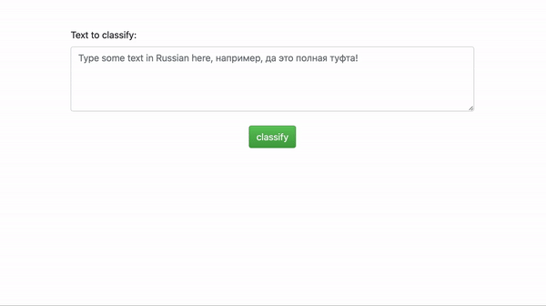

In this project we built a Russian sentiment analysis model and deployed it as a web application using Flask.

Model training tutorial can be found in [this colab notebook](https://colab.research.google.com/drive/1VAxpnNyP32kpwLzGB9MtCci3PX3Uzv3g?usp=sharing) or as a [jupyter notebook here](https://github.com/birlikov/ru_sentiment_clf/blob/master/Fine_tuning_Multilingual_Universal_Sentence_Encoder.ipynb). 

After training the model save it in folder *models/ru_sentiment_clf* in current directory, as it will be used in web application.

##### How to run this

First, make sure you created *models/ru_sentiment_clf* path in current directory and placed saved model files inside it. See how it is done in above model training tutorial.

Then, open terminal and run `sh build_docker_image.sh`.
- This builds our docker container where we run the app.

Next, run `sh run.sh`. 
- This will mount the current directory to a */usr/workdir* directory inside the built container
- Export the port 80 outside the container so we can access it from our browser
- Runs the `web_app.py` 

As we just mounted the current folder to a folder inside the container, we can do some changes in code or model, and just re-run `run.sh` to see the effect, no need to rebuild the container.

Here is the demo of web application:
